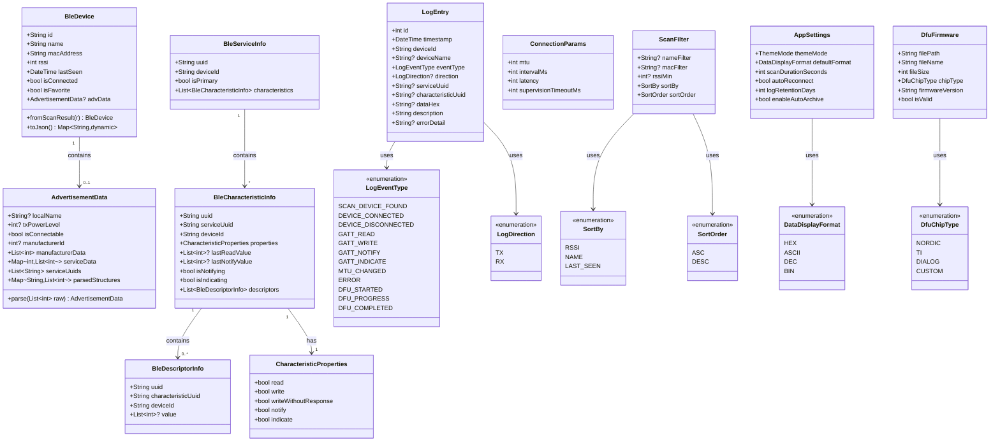
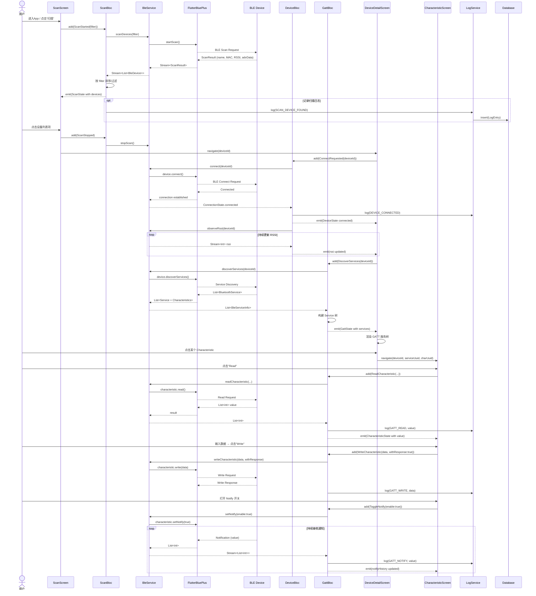
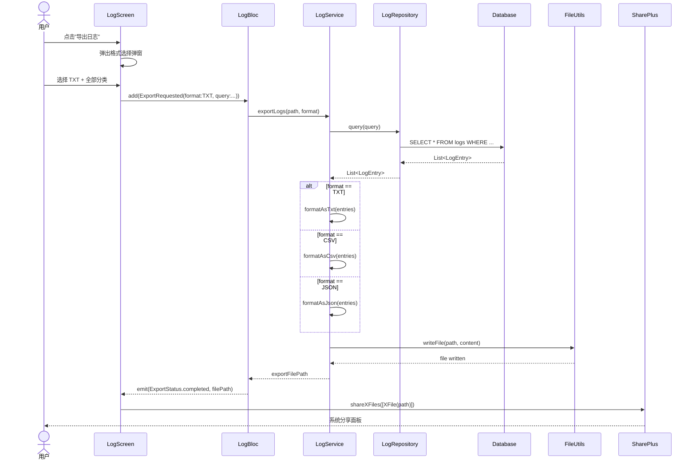
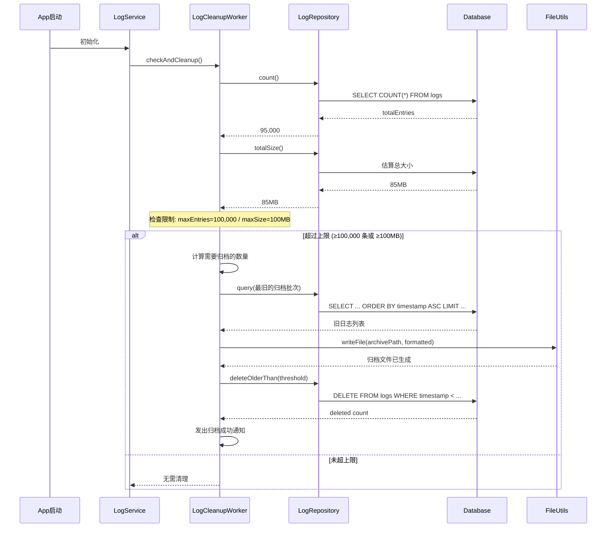
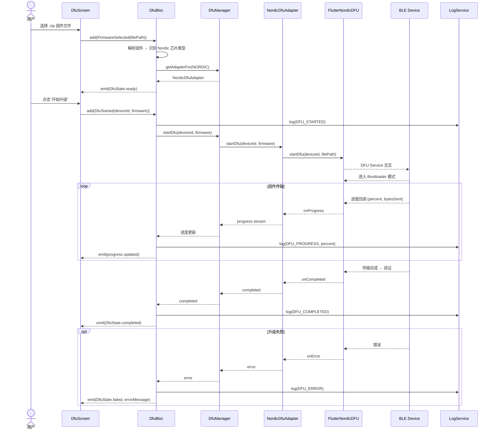
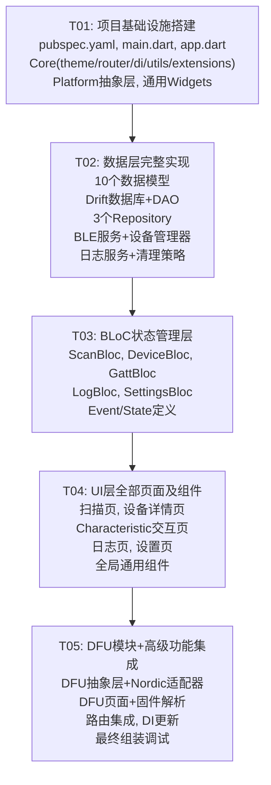

# BLE 蓝牙助手 — 系统架构设计文档

> **项目名称**：ble_helper  
> **技术栈**：Flutter 3.x + Dart 3.x  
> **目标平台**：Android（架构预留 iOS）  
> **架构模式**：Clean Architecture 分层架构 + BLoC 状态管理  
> **文档版本**：v1.0  
> **作者**：Bob（架构师）

---

## Part A: 系统设计

---

## 1. 实现方案 (Implementation Approach)

### 1.1 核心技术挑战

| 挑战 | 描述 | 应对策略 |
|------|------|---------|
| **BLE 平台差异** | Android/iOS 的 BLE 权限模型、蓝牙栈行为不同 | 通过 Platform Abstraction Layer (PAL) 封装，flutter_blue_plus 已提供基础的跨平台 BLE API |
| **多设备并发连接** | 同时管理多台设备的 GATT 操作，需避免状态混乱 | 以 `deviceId` 为 key 的 Map 管理多个 DeviceBloc 实例，每个设备独立的 GATT 操作队列 |
| **DFU 芯片兼容** | Nordic、TI、Dialog 等芯片 DFU 协议不同 | Adapter 模式设计 `DfuAdapter` 抽象接口，每种芯片实现独立 Adapter |
| **日志量控制** | 日志持续增长可能影响性能/存储 | 自动清理策略：10万条或100MB 上限，超限触发归档（旧日志导出为文件后清空） |
| **BLE 操作异步性** | 所有 BLE 操作均为异步回调，需统一错误处理 | BLoC 模式天然适合异步事件流；所有 BLE 操作封装为 `async`/`await` + `try/catch` |

### 1.2 技术选型

| 类别 | 选型 | 版本 | 理由 |
|------|------|------|------|
| **跨平台框架** | Flutter | ≥3.22.x | Google 官方，Dart 语言，高性能渲染 |
| **状态管理** | flutter_bloc | ^8.1.x | 成熟稳定，事件驱动，适合 BLE 异步操作流 |
| **BLE 核心** | flutter_blue_plus | ^1.32.x | 社区最活跃的 Flutter BLE 库，支持 Android/iOS/macOS |
| **DFU (Nordic)** | flutter_nordic_dfu | ^6.1.x | Nordic 官方推荐，成熟稳定 |
| **本地数据库** | drift (sqflite) | ^2.22.x | 类型安全、支持流式查询、自动迁移 |
| **图表** | fl_chart | ^0.69.x | 纯 Dart 实现，高性能实时曲线 |
| **文件分享** | share_plus | ^10.1.x | 系统原生分享面板 |
| **路由** | go_router | ^14.x | Flutter 官方推荐，声明式路由 |
| **依赖注入** | get_it | ^8.x | 轻量级 Service Locator，无代码生成 |
| **权限管理** | permission_handler | ^11.x | 蓝牙/定位权限统一管理 |
| **UI** | Material Design 3 | Flutter SDK 内置 | 原生支持动态颜色、暗色模式 |

### 1.3 架构分层

```
┌─────────────────────────────────────────────────────┐
│  Presentation Layer                                 │
│  ┌──────────┐ ┌──────────┐ ┌──────────┐            │
│  │ Screens   │ │ Widgets  │ │ BLoCs    │            │
│  └──────────┘ └──────────┘ └──────────┘            │
├─────────────────────────────────────────────────────┤
│  Domain Layer                                       │
│  ┌──────────┐ ┌──────────┐ ┌──────────┐            │
│  │ Models   │ │ Abstracts│ │ UseCases │  (可选)    │
│  └──────────┘ └──────────┘ └──────────┘            │
├─────────────────────────────────────────────────────┤
│  Data Layer                                         │
│  ┌──────────┐ ┌──────────┐ ┌──────────┐            │
│  │Repositories│ │Database │ │ Services │            │
│  └──────────┘ └──────────┘ └──────────┘            │
├─────────────────────────────────────────────────────┤
│  Platform Layer (PAL)                               │
│  ┌──────────┐ ┌──────────┐ ┌──────────┐            │
│  │ Android  │ │ iOS(stub)│ │ BleAbstr │            │
│  └──────────┘ └──────────┘ └──────────┘            │
├─────────────────────────────────────────────────────┤
│  Core                                               │
│  ┌──────────┐ ┌──────────┐ ┌──────────┐            │
│  │ Theme    │ │ Router   │ │ Constants│            │
│  └──────────┘ └──────────┘ └──────────┘            │
└─────────────────────────────────────────────────────┘
```

---

## 2. 文件列表 (File List)

```
ble_helper/
├── pubspec.yaml                          # 项目依赖声明
├── analysis_options.yaml                 # Dart 静态分析配置
├── lib/
│   ├── main.dart                         # 应用入口，初始化依赖注入
│   ├── app.dart                          # MaterialApp 配置（主题、路由、多语言）
│   │
│   ├── core/
│   │   ├── constants/
│   │   │   ├── app_constants.dart        # 全局常量（日志上限、默认MTU等）
│   │   │   ├── ble_constants.dart        # BLE 相关常量（UUID格式等）
│   │   │   └── ui_constants.dart         # UI 常量（间距、圆角等）
│   │   ├── theme/
│   │   │   ├── app_theme.dart            # 主题入口，管理亮/暗色主题切换
│   │   │   ├── app_colors.dart           # 语义化颜色定义
│   │   │   └── app_typography.dart       # 字体排版样式
│   │   ├── router/
│   │   │   └── app_router.dart           # GoRouter 路由配置
│   │   ├── di/
│   │   │   └── injection_container.dart  # GetIt 依赖注入注册
│   │   ├── utils/
│   │   │   ├── data_formatter.dart       # Hex/ASCII/Dec/BIN 格式互转工具
│   │   │   ├── ble_utils.dart            # BLE 工具函数（UUID格式化等）
│   │   │   └── file_utils.dart           # 文件读写、导出路径工具
│   │   └── extensions/
│   │       ├── datetime_extension.dart   # DateTime 格式化扩展
│   │       └── string_extension.dart     # String 工具扩展
│   │
│   ├── data/
│   │   ├── models/
│   │   │   ├── ble_device.dart           # BLE 设备扫描结果模型
│   │   │   ├── ble_service.dart          # GATT Service 模型
│   │   │   ├── ble_characteristic.dart   # Characteristic 模型
│   │   │   ├── ble_descriptor.dart       # Descriptor 模型
│   │   │   ├── advertisement_data.dart   # 广播数据解析模型
│   │   │   ├── scan_filter.dart          # 扫描过滤条件模型
│   │   │   ├── log_entry.dart            # 日志条目模型
│   │   │   ├── connection_params.dart    # 连接参数模型
│   │   │   ├── dfu_firmware.dart         # DFU 固件信息模型
│   │   │   └── app_settings.dart         # App 设置模型
│   │   ├── database/
│   │   │   ├── app_database.dart         # Drift 数据库定义（表、DAO）
│   │   │   ├── app_database.g.dart       # Drift 自动生成（不手动编辑）
│   │   │   ├── dao/
│   │   │   │   ├── log_dao.dart          # 日志数据访问对象
│   │   │   │   └── device_dao.dart       # 收藏设备数据访问对象
│   │   │   └── converters/
│   │   │       └── type_converters.dart  # Drift 自定义类型转换器
│   │   └── repositories/
│   │       ├── device_repository.dart    # 设备管理仓库（收藏、历史）
│   │       ├── log_repository.dart       # 日志仓库（写入、查询、清理、导出）
│   │       └── settings_repository.dart  # 设置仓库（持久化用户偏好）
│   │
│   ├── services/
│   │   ├── ble/
│   │   │   ├── ble_service_interface.dart   # BLE 操作抽象接口
│   │   │   ├── ble_service.dart             # flutter_blue_plus 实现
│   │   │   ├── ble_device_manager.dart       # 多设备连接管理器
│   │   │   └── ble_gatt_operator.dart        # GATT 操作队列管理器
│   │   ├── dfu/
│   │   │   ├── dfu_adapter_interface.dart    # DFU 适配器抽象接口
│   │   │   ├── nordic_dfu_adapter.dart       # Nordic DFU 实现
│   │   │   ├── dfu_manager.dart             # DFU 升级流程管理器
│   │   │   └── dfu_firmware_parser.dart      # 固件文件解析器（ZIP/HEX/BIN）
│   │   ├── log/
│   │   │   ├── log_service.dart              # 日志写入、查询、归档服务
│   │   │   └── log_cleanup_worker.dart       # 日志自动清理策略执行器
│   │   └── platform/
│   │       ├── platform_interface.dart       # 平台抽象接口定义
│   │       ├── platform_android.dart         # Android 平台实现
│   │       └── platform_ios_stub.dart        # iOS 平台桩实现（预留）
│   │
│   ├── bloc/
│   │   ├── scan/
│   │   │   ├── scan_bloc.dart                # 扫描业务逻辑
│   │   │   ├── scan_event.dart               # 扫描事件定义
│   │   │   └── scan_state.dart               # 扫描状态定义
│   │   ├── device/
│   │   │   ├── device_bloc.dart              # 设备连接/断开逻辑
│   │   │   ├── device_event.dart
│   │   │   └── device_state.dart
│   │   ├── gatt/
│   │   │   ├── gatt_bloc.dart                # GATT 操作逻辑（Read/Write/Notify）
│   │   │   ├── gatt_event.dart
│   │   │   └── gatt_state.dart
│   │   ├── log/
│   │   │   ├── log_bloc.dart                 # 日志展示/过滤/导出逻辑
│   │   │   ├── log_event.dart
│   │   │   └── log_state.dart
│   │   ├── settings/
│   │   │   ├── settings_bloc.dart            # 设置管理逻辑
│   │   │   ├── settings_event.dart
│   │   │   └── settings_state.dart
│   │   └── dfu/
│   │       ├── dfu_bloc.dart                 # DFU 升级流程状态机
│   │       ├── dfu_event.dart
│   │       └── dfu_state.dart
│   │
│   ├── screens/
│   │   ├── scan/
│   │   │   ├── scan_screen.dart              # 扫描页（主页）
│   │   │   └── widgets/
│   │   │       ├── device_list_tile.dart     # 设备列表项组件
│   │   │       ├── scan_filter_dialog.dart   # 过滤条件弹窗
│   │   │       └── rssi_indicator.dart       # RSSI 信号条组件
│   │   ├── device_detail/
│   │   │   ├── device_detail_screen.dart     # 设备详情页（Tab容器）
│   │   │   └── widgets/
│   │   │       ├── gatt_service_tree.dart    # GATT 服务树组件
│   │   │       ├── rssi_chart.dart           # RSSI 实时曲线组件 (fl_chart)
│   │   │       ├── device_info_card.dart     # 设备信息卡片
│   │   │       └── device_log_list.dart      # 设备专属日志列表
│   │   ├── characteristic/
│   │   │   ├── characteristic_screen.dart    # Characteristic 交互页
│   │   │   └── widgets/
│   │   │       ├── read_section.dart         # Read 操作区域
│   │   │       ├── write_section.dart        # Write 操作区域
│   │   │       ├── notify_section.dart       # Notify/Indicate 区域
│   │   │       └── descriptor_list.dart      # Descriptor 列表
│   │   ├── log/
│   │   │   ├── log_screen.dart              # 日志总览页
│   │   │   └── widgets/
│   │   │       ├── log_entry_tile.dart       # 日志条目组件
│   │   │       └── log_export_dialog.dart    # 导出格式选择弹窗
│   │   ├── settings/
│   │   │   ├── settings_screen.dart          # 设置页
│   │   │   └── widgets/
│   │   │       ├── scan_settings_section.dart
│   │   │       └── theme_selector.dart       # 主题选择器
│   │   └── dfu/
│   │       ├── dfu_screen.dart               # DFU 固件升级页
│   │       └── widgets/
│   │           ├── firmware_picker.dart       # 固件文件选择
│   │           └── dfu_progress.dart          # DFU 进度展示
│   │
│   └── widgets/                              # 全局通用组件
│       ├── app_scaffold.dart                  # 通用 Scaffold 包装
│       ├── data_display.dart                  # Hex/ASCII 数据显示组件
│       ├── data_input.dart                    # Hex/ASCII 数据输入组件
│       ├── format_switcher.dart               # 数据格式切换按钮组
│       ├── empty_state.dart                   # 空状态占位组件
│       ├── error_state.dart                   # 错误状态占位组件
│       ├── loading_indicator.dart             # 加载指示器
│       └── connection_status_badge.dart       # 连接状态标识
│
├── assets/
│   └── l10n/                                 # 国际化资源文件（P2预留）
│       ├── app_zh.arb
│       └── app_en.arb
│
└── test/
    ├── services/
    │   ├── ble_service_test.dart              # BLE Service 单元测试
    │   └── log_service_test.dart              # 日志服务单元测试
    ├── bloc/
    │   ├── scan_bloc_test.dart
    │   ├── device_bloc_test.dart
    │   ├── gatt_bloc_test.dart
    │   └── log_bloc_test.dart
    └── widgets/
        ├── device_list_tile_test.dart
        └── data_display_test.dart
```

---

## 3. 数据结构与接口 (Data Structures & Interfaces)

### 3.1 核心数据模型



### 3.2 服务层接口

```mermaid
classDiagram
    direction TB

    %% ========== BLE Service Interface ==========
    class IBleService {
        <<interface>>
        +Stream~List~BleDevice~~ scanDevices(ScanFilter? filter) Stream
        +Future~void~ stopScan()
        +Future~void~ connect(String deviceId)
        +Future~void~ disconnect(String deviceId)
        +Future~List~BleServiceInfo~~ discoverServices(String deviceId)
        +Future~List~int~~ readCharacteristic(String deviceId, String serviceUuid, String charUuid)
        +Future~void~ writeCharacteristic(String deviceId, String serviceUuid, String charUuid, List~int~ data, bool withResponse)
        +Future~void~ setNotify(String deviceId, String serviceUuid, String charUuid, bool enable)
        +Future~int~ requestMtu(String deviceId, int mtu)
        +Stream~int~~ observeRssi(String deviceId)
        +Stream~ConnectionState~~ observeConnection(String deviceId)
        +Future~List~int~~ readDescriptor(String deviceId, String serviceUuid, String charUuid, String descUuid)
        +Future~void~ writeDescriptor(String deviceId, String serviceUuid, String charUuid, String descUuid, List~int~ data)
        +Stream~List~BleCharacteristicInfo~~ observeNotifyValue(String deviceId, String serviceUuid, String charUuid)
    }

    class BleService {
        -FlutterBluePlus _flutterBlue
        -Map~String, BluetoothDevice~ _connectedDevices
        -Map~String, StreamSubscription~ _notifySubscriptions
        +BleService()
        +all methods from IBleService
    }

    class BleDeviceManager {
        -BleService _bleService
        -Map~String, BleGattOperator~ _gattOperators
        -int _maxConcurrentDevices
        +connect(String deviceId)
        +disconnect(String deviceId)
        +getOperator(String deviceId) BleGattOperator
        +getConnectedDeviceIds() List~String~
        +isConnected(String deviceId) bool
    }

    class BleGattOperator {
        -String _deviceId
        -Queue~GattOperation~ _operationQueue
        -bool _isProcessing
        +enqueueRead(String serviceUuid, String charUuid)
        +enqueueWrite(String serviceUuid, String charUuid, List~int~ data, bool withResponse)
        +enqueueSetNotify(String serviceUuid, String charUuid, bool enable)
        +enqueueReadDescriptor(String serviceUuid, String charUuid, String descUuid)
        +dispose()
    }

    %% ========== DFU Interface ==========
    class IDfuAdapter {
        <<interface>>
        +bool isSupported(DfuChipType chipType)
        +DfuChipType get chipType
        +Future~void~ startDfu(String deviceId, DfuFirmware firmware)
        +Future~void~ abortDfu()
        +Stream~DfuProgress~~ observeProgress()
        +Stream~DfuState~~ observeState()
    }

    class NordicDfuAdapter {
        -FlutterNordicDfu _nordicDfu
        +isSupported(DfuChipType chipType) bool
        +DfuChipType get chipType
        +startDfu(String deviceId, DfuFirmware firmware)
        +abortDfu()
        +observeProgress() Stream~DfuProgress~
        +observeState() Stream~DfuState~
    }

    class DfuManager {
        -List~IDfuAdapter~ _adapters
        -IDfuAdapter? _activeAdapter
        +registerAdapter(IDfuAdapter adapter)
        +getAdapterFor(DfuChipType chipType) IDfuAdapter?
        +startDfu(String deviceId, DfuFirmware firmware)
        +abortDfu()
        +observeProgress() Stream~DfuProgress~
    }

    class DfuProgress {
        +int percent
        +int bytesSent
        +int totalBytes
        +double speedKbps
    }

    class DfuState {
        <<enumeration>>
        IDLE
        CONNECTING
        UPLOADING
        VERIFYING
        COMPLETED
        FAILED
        ABORTED
    }

    %% ========== Log Service ==========
    class ILogService {
        <<interface>>
        +Future~void~ log(LogEntry entry)
        +Future~List~LogEntry~~ query(LogQuery query)
        +Future~void~ exportLogs(String filePath, LogExportFormat format)
        +Future~void~ archiveAndClean()
        +Future~LogStats~ getStats()
        +Stream~LogEntry~~ observeLogs(LogQuery? query)
    }

    class LogService {
        -LogRepository _repository
        -LogCleanupWorker _cleanupWorker
        -int _maxEntries
        -int _maxSizeBytes
        +LogService()
        +all methods from ILogService
        -_checkLimits()
    }

    class LogCleanupWorker {
        -int _maxEntries
        -int _maxSizeBytes
        -LogRepository _repository
        +checkAndCleanup() Future~void~
        -_archiveOldLogs() Future~String?
        -_deleteOldest(int count) Future~void~
    }

    class LogQuery {
        +LogEventType? eventType
        +String? deviceId
        +DateTime? startTime
        +DateTime? endTime
        +String? searchText
        +int? limit
        +int? offset
        +LogSortField sortField
        +SortOrder sortOrder
    }

    class LogStats {
        +int totalEntries
        +int totalSizeBytes
        +DateTime oldestEntry
        +DateTime newestEntry
        +Map~LogEventType,int~ typeDistribution
    }

    class LogExportFormat {
        <<enumeration>>
        TXT
        CSV
        JSON
    }

    class LogSortField {
        <<enumeration>>
        TIMESTAMP
        EVENT_TYPE
        DEVICE_NAME
    }

    %% ========== Platform Abstraction ==========
    class IPlatformHelper {
        <<interface>>
        +Future~bool~ requestBluetoothPermissions()
        +Future~bool~ requestLocationPermissions()
        +Future~bool~ isBluetoothEnabled()
        +Future~bool~ enableBluetooth()
        +Future~bool~ isLocationEnabled()
        +Future~String~ getDeviceMacAddress()
        +Future~String~ getAppDocumentsPath()
        +Future~String~ getAppCachePath()
        +Future~bool~ isAndroid()
        +Future~bool~ isIOS()
    }

    class AndroidPlatformHelper {
        +all methods from IPlatformHelper
        -_checkAndroid12Permissions()
        -_checkAndroid10Permissions()
    }

    class IosPlatformStub {
        <<stub>>
        +all methods from IPlatformHelper
        -throws UnsupportedError
    }

    %% ========== Repositories ==========
    class DeviceRepository {
        -AppDatabase _db
        +getFavoriteDevices() Future~List~BleDevice~~
        +addFavorite(BleDevice device) Future~void~
        +removeFavorite(String deviceId) Future~void~
        +isFavorite(String deviceId) Future~bool~
        +getConnectionHistory() Future~List~BleDevice~~
        +recordConnection(BleDevice device) Future~void~
    }

    class LogRepository {
        -AppDatabase _db
        +insert(LogEntry entry) Future~int~
        +batchInsert(List~LogEntry~ entries) Future~void~
        +query(LogQuery query) Future~List~LogEntry~~
        +watchEntries(LogQuery? query) Stream~List~LogEntry~~
        +deleteOlderThan(DateTime threshold) Future~int~
        +deleteOldest(int count) Future~int~
        +count() Future~int~
        +totalSize() Future~int~
        +deleteAll() Future~int~
    }

    class SettingsRepository {
        -SharedPreferences _prefs
        +getSettings() Future~AppSettings~
        +saveSettings(AppSettings settings) Future~void~
        +getThemeMode() ThemeMode
        +setThemeMode(ThemeMode mode)
        +getDefaultFormat() DataDisplayFormat
        +setDefaultFormat(DataDisplayFormat format)
    }

    %% ========== Relationships ==========
    IBleService <|.. BleService : implements
    BleDeviceManager --> IBleService : uses
    BleDeviceManager --> BleGattOperator : manages
    BleGattOperator --> IBleService : uses

    IDfuAdapter <|.. NordicDfuAdapter : implements
    DfuManager --> IDfuAdapter : manages

    ILogService <|.. LogService : implements
    LogService --> LogRepository : uses
    LogService --> LogCleanupWorker : uses
    LogCleanupWorker --> LogRepository : uses

    IPlatformHelper <|.. AndroidPlatformHelper : implements
    IPlatformHelper <|.. IosPlatformStub : implements
```



### 3.3 BLoC 状态管理

```mermaid
classDiagram
    direction TB

    %% ========== Scan BLoC ==========
    class ScanBloc {
        -IBleService _bleService
        -ILogService _logService
        +ScanBloc()
        +onScanStarted(ScanStarted event) void
        +onScanStopped(ScanStopped event) void
        +onFilterChanged(FilterChanged event) void
    }

    class ScanState {
        +List~BleDevice~ devices
        +bool isScanning
        +ScanFilter filter
        +ScanStatus status
        +String? errorMessage
        +copyWith(...)
    }

    class ScanEvent {
        <<abstract>>
    }

    class ScanStarted {
        +ScanFilter filter
    }

    class ScanStopped {}
    class FilterChanged {
        +ScanFilter filter
    }
    class ScanDeviceFound {
        +BleDevice device
    }
    class ScanError {
        +String message
    }

    %% ========== Device BLoC ==========
    class DeviceBloc {
        -IBleService _bleService
        -ILogService _logService
        -DeviceRepository _deviceRepo
        +DeviceBloc(String deviceId)
        +onConnectRequested(ConnectRequested event) void
        +onDisconnectRequested(DisconnectRequested event) void
        +onMtuRequested(MtuRequested event) void
        +onRssiUpdated(RssiUpdated event) void
    }

    class DeviceState {
        +String deviceId
        +ConnectionState connectionState
        +int rssi
        +int mtu
        +ConnectionParams? connectionParams
        +String? errorMessage
        +copyWith(...)
    }

    %% ========== GATT BLoC ==========
    class GattBloc {
        -IBleService _bleService
        -ILogService _logService
        -BleGattOperator _gattOperator
        +GattBloc(String deviceId)
        +onDiscoverServices(DiscoverServices event) void
        +onReadCharacteristic(ReadCharacteristic event) void
        +onWriteCharacteristic(WriteCharacteristic event) void
        +onToggleNotify(ToggleNotify event) void
        +onReadDescriptor(ReadDescriptor event) void
    }

    class GattState {
        +List~BleServiceInfo~ services
        +bool isLoadingServices
        +Map~String, CharacteristicState~ characteristicStates
        +DataDisplayFormat displayFormat
        +String? errorMessage
        +copyWith(...)
    }

    class CharacteristicState {
        +List~int~? value
        +bool isReading
        +bool isWriting
        +bool isNotifying
        +bool isIndicating
        +List~List~int~~ notifyHistory
    }

    %% ========== Log BLoC ==========
    class LogBloc {
        -ILogService _logService
        +LogBloc()
        +onLogsRequested(LogsRequested event) void
        +onLogFilterChanged(LogFilterChanged event) void
        +onExportRequested(ExportRequested event) void
        +onClearLogs(ClearLogs event) void
    }

    class LogState {
        +List~LogEntry~ entries
        +LogQuery query
        +LogExportStatus exportStatus
        +LogStats? stats
        +String? exportFilePath
        +copyWith(...)
    }

    %% ========== Settings BLoC ==========
    class SettingsBloc {
        -SettingsRepository _settingsRepo
        +SettingsBloc()
        +onSettingsLoaded(SettingsLoaded event) void
        +onThemeChanged(ThemeChanged event) void
        +onFormatChanged(FormatChanged event) void
        +onScanDurationChanged(ScanDurationChanged event) void
    }

    class SettingsState {
        +AppSettings settings
        +bool isLoaded
        +copyWith(...)
    }

    %% ========== DFU BLoC ==========
    class DfuBloc {
        -DfuManager _dfuManager
        -ILogService _logService
        +DfuBloc()
        +onFirmwareSelected(FirmwareSelected event) void
        +onDfuStarted(DfuStarted event) void
        +onDfuAborted(DfuAborted event) void
    }

    class DfuState {
        +DfuFirmware? firmware
        +DfuProcessState processState
        +int progressPercent
        +String? errorMessage
        +copyWith(...)
    }

    class DfuProcessState {
        <<enumeration>>
        IDLE
        READY
        IN_PROGRESS
        COMPLETED
        FAILED
    }

    %% ========== Event/State Inheritance ==========
    ScanEvent <|-- ScanStarted
    ScanEvent <|-- ScanStopped
    ScanEvent <|-- FilterChanged
    ScanEvent <|-- ScanDeviceFound
    ScanEvent <|-- ScanError
```



---

## 4. 程序调用流程 (Program Call Flow)

### 4.1 扫描→连接→GATT浏览→数据交互 完整流程



### 4.2 日志导出流程



### 4.3 日志自动清理流程



### 4.4 DFU 固件升级流程



---

## 5. 待明确事项 (Anything UNCLEAR)

| # | 事项 | 假设 |
|---|------|------|
| 1 | **iOS 蓝牙权限细节** | 当前按 iOS 13+ 的 `NSBluetoothAlwaysUsageDescription` 预设，具体权限文案待 iOS 适配时确认 |
| 2 | **DFU 多芯片适配优先级** | 假设 Nordic > TI > Dialog 的顺序；TI 和 Dialog 的具体 Flutter 库尚未选定，需后续调研 |
| 3 | **多设备并发数量上限** | 默认设为 4 台同时连接，由 `BleDeviceManager._maxConcurrentDevices` 配置 |
| 4 | **扫描时长** | 默认 30 秒自动停止，可在设置中调整（10s/30s/60s/无限） |
| 5 | **广播数据解析深度** | P1 阶段实现标准 AD Structure 解析（Flags、UUID List、TX Power、Local Name），iBeacon/Eddystone 留给 P2 |
| 6 | **数据库迁移策略** | 使用 Drift 的 schema migration，版本升级自动处理 |
| 7 | **日志归档文件路径** | 归档到 `appDocuments/ble_logs/archive/`，用户可通过设置页进入管理 |
| 8 | **连接参数调节权限** | Android 需要 `BLUETOOTH_PRIVILEGED` 权限（系统应用），普通应用可能被忽略，UI 上需给用户提示 |

---

---

## Part B: 任务分解

---

## 6. 依赖包列表 (Required Packages)

```yaml
# pubspec.yaml dependencies
dependencies:
  flutter:
    sdk: flutter

  # State Management
  flutter_bloc: ^8.1.6
  bloc: ^8.1.4

  # BLE Core
  flutter_blue_plus: ^1.32.13

  # DFU (Nordic)
  flutter_nordic_dfu: ^6.1.0

  # Database
  drift: ^2.22.1
  sqlite3_flutter_libs: ^0.5.26
  path_provider: ^2.1.5
  path: ^1.9.0

  # DI
  get_it: ^8.0.3

  # Router
  go_router: ^14.6.2

  # Charts
  fl_chart: ^0.69.2

  # File Sharing & Export
  share_plus: ^10.1.4

  # Permissions
  permission_handler: ^11.3.1

  # Storage
  shared_preferences: ^2.3.4

  # Utilities
  uuid: ^4.5.1
  collection: ^1.19.0
  equatable: ^2.0.7
  intl: ^0.19.0

dev_dependencies:
  flutter_test:
    sdk: flutter
  flutter_lints: ^5.0.0
  drift_dev: ^2.22.1
  build_runner: ^2.4.13
  bloc_test: ^9.1.7
  mockito: ^5.4.4
  mocktail: ^1.0.4
```

---

## 7. 任务列表 (Task List — ordered by dependency)

### ⚠️ 共计 5 个任务（硬性上限），按依赖顺序排列

---

| 属性 | 值 |
|------|-----|
| **Task ID** | T01 |
| **Task Name** | 项目基础设施搭建 |
| **Source Files** | `pubspec.yaml`, `analysis_options.yaml`, `lib/main.dart`, `lib/app.dart`, `lib/core/constants/app_constants.dart`, `lib/core/constants/ble_constants.dart`, `lib/core/constants/ui_constants.dart`, `lib/core/theme/app_theme.dart`, `lib/core/theme/app_colors.dart`, `lib/core/theme/app_typography.dart`, `lib/core/router/app_router.dart`, `lib/core/di/injection_container.dart`, `lib/core/utils/data_formatter.dart`, `lib/core/utils/ble_utils.dart`, `lib/core/utils/file_utils.dart`, `lib/core/extensions/datetime_extension.dart`, `lib/core/extensions/string_extension.dart`, `lib/widgets/empty_state.dart`, `lib/widgets/error_state.dart`, `lib/widgets/loading_indicator.dart`, `lib/data/database/converters/type_converters.dart`, `lib/services/platform/platform_interface.dart`, `lib/services/platform/platform_android.dart`, `lib/services/platform/platform_ios_stub.dart` |
| **Dependencies** | 无 |
| **Priority** | P0 |

**描述**：
- 创建 Flutter 项目骨架，配置 `pubspec.yaml` 引入所有依赖
- 实现 `main.dart` 入口：初始化 GetIt DI 容器、Drift 数据库、MaterialApp
- 实现 `app.dart`：MaterialApp 3 配置（主题、暗色模式、GoRouter 路由表骨架）
- 实现 Core 层全部基础模块：常量定义、主题系统（亮/暗色两套）、路由骨架（占位路由）、DI 容器注册
- 实现数据格式工具（Hex/ASCII/Dec/Bin 互转）
- 实现平台抽象层（IPlatformHelper + Android 实现 + iOS 桩实现）
- 实现通用 UI 组件（空状态、错误状态、加载指示器占位）
- 实现 Drift 自定义类型转换器

---

| 属性 | 值 |
|------|-----|
| **Task ID** | T02 |
| **Task Name** | 数据层完整实现（模型 + 数据库 + 仓库 + BLE/日志服务） |
| **Source Files** | `lib/data/models/ble_device.dart`, `lib/data/models/ble_service.dart`, `lib/data/models/ble_characteristic.dart`, `lib/data/models/ble_descriptor.dart`, `lib/data/models/advertisement_data.dart`, `lib/data/models/scan_filter.dart`, `lib/data/models/log_entry.dart`, `lib/data/models/connection_params.dart`, `lib/data/models/dfu_firmware.dart`, `lib/data/models/app_settings.dart`, `lib/data/database/app_database.dart`, `lib/data/database/dao/log_dao.dart`, `lib/data/database/dao/device_dao.dart`, `lib/data/repositories/device_repository.dart`, `lib/data/repositories/log_repository.dart`, `lib/data/repositories/settings_repository.dart`, `lib/services/ble/ble_service_interface.dart`, `lib/services/ble/ble_service.dart`, `lib/services/ble/ble_device_manager.dart`, `lib/services/ble/ble_gatt_operator.dart`, `lib/services/log/log_service.dart`, `lib/services/log/log_cleanup_worker.dart` |
| **Dependencies** | T01 |
| **Priority** | P0 |

**描述**：
- 实现全部 10 个数据模型 (Dart class)，支持 `toJson`/`fromJson`/`copyWith`
- 实现 Drift 数据库定义（logs 表 + favorite_devices 表 + connection_history 表），包含 DAO 层（含流式查询 `watchEntries`）
- 实现三个 Repository（DeviceRepository、LogRepository、SettingsRepository）
- 实现 IBleService 抽象接口和 BleService 实现（基于 flutter_blue_plus，封装所有 BLE 操作）
- 实现 BleDeviceManager（多设备并发连接 Map 管理）和 BleGattOperator（单设备 GATT 操作队列）
- 实现 LogService（日志写入、查询、格式导出为 TXT/CSV/JSON）
- 实现 LogCleanupWorker（检查 10万条/100MB 上限 → 超限触发归档 + 清空旧数据）
- 在 `injection_container.dart` 中注册所有服务和仓库

---

| 属性 | 值 |
|------|-----|
| **Task ID** | T03 |
| **Task Name** | BLoC 状态管理层完整实现 |
| **Source Files** | `lib/bloc/scan/scan_bloc.dart`, `lib/bloc/scan/scan_event.dart`, `lib/bloc/scan/scan_state.dart`, `lib/bloc/device/device_bloc.dart`, `lib/bloc/device/device_event.dart`, `lib/bloc/device/device_state.dart`, `lib/bloc/gatt/gatt_bloc.dart`, `lib/bloc/gatt/gatt_event.dart`, `lib/bloc/gatt/gatt_state.dart`, `lib/bloc/log/log_bloc.dart`, `lib/bloc/log/log_event.dart`, `lib/bloc/log/log_state.dart`, `lib/bloc/settings/settings_bloc.dart`, `lib/bloc/settings/settings_event.dart`, `lib/bloc/settings/settings_state.dart` |
| **Dependencies** | T02 |
| **Priority** | P0 |

**描述**：
- 实现 ScanBloc：管理扫描生命周期（开始/停止/过滤/排序/设备列表更新），扫描期间自动记录 SCAN_DEVICE_FOUND 日志
- 实现 DeviceBloc：管理单设备连接/断开/Mtu 协商/RSSI 实时监测，自动记录连接事件日志
- 实现 GattBloc：管理 Service 发现、Characteristic Read/Write/Notify/Indicate 全部操作，通过 BleGattOperator 队列化执行，自动记录 GATT 操作日志
- 实现 LogBloc：管理日志查询/过滤（按类型、设备、时间范围、关键词搜索）/分页/导出触发
- 实现 SettingsBloc：管理主题切换/默认格式/扫描时长等用户偏好持久化
- 所有 Event 继承 `Equatable`，State 支持 `copyWith`
- 在 DI 容器中注册全部 Bloc（工厂模式，支持 BlocProvider 按需创建）

---

| 属性 | 值 |
|------|-----|
| **Task ID** | T04 |
| **Task Name** | UI 层全部页面及组件实现 |
| **Source Files** | `lib/screens/scan/scan_screen.dart`, `lib/screens/scan/widgets/device_list_tile.dart`, `lib/screens/scan/widgets/scan_filter_dialog.dart`, `lib/screens/scan/widgets/rssi_indicator.dart`, `lib/screens/device_detail/device_detail_screen.dart`, `lib/screens/device_detail/widgets/gatt_service_tree.dart`, `lib/screens/device_detail/widgets/rssi_chart.dart`, `lib/screens/device_detail/widgets/device_info_card.dart`, `lib/screens/device_detail/widgets/device_log_list.dart`, `lib/screens/characteristic/characteristic_screen.dart`, `lib/screens/characteristic/widgets/read_section.dart`, `lib/screens/characteristic/widgets/write_section.dart`, `lib/screens/characteristic/widgets/notify_section.dart`, `lib/screens/characteristic/widgets/descriptor_list.dart`, `lib/screens/log/log_screen.dart`, `lib/screens/log/widgets/log_entry_tile.dart`, `lib/screens/log/widgets/log_export_dialog.dart`, `lib/screens/settings/settings_screen.dart`, `lib/screens/settings/widgets/scan_settings_section.dart`, `lib/screens/settings/widgets/theme_selector.dart`, `lib/widgets/app_scaffold.dart`, `lib/widgets/data_display.dart`, `lib/widgets/data_input.dart`, `lib/widgets/format_switcher.dart`, `lib/widgets/connection_status_badge.dart` |
| **Dependencies** | T03 |
| **Priority** | P0 |

**描述**：
- 实现扫描页：包含搜索栏（名称/MAC过滤）、排序切换（RSSI/名称）、设备列表（名称+MAC+RSSI信号条+广播类型图标）、扫描状态指示器+扫描/停止 FAB、蓝牙未开启引导空状态。使用 `BlocProvider<ScanBloc>` + `BlocBuilder`
- 实现设备详情页：顶部设备名称+RSSI实时值+连接状态徽章+断开按钮，TabBar 切换 GATT服务树 / RSSI曲线(fl_chart) / 设备信息(MTU+连接参数) / 设备专属日志
- 实现 Characteristic 交互页：顶部 UUID+属性标签 Read 区域（按钮+数据显示区+格式切换）, Write 区域（输入框+Hex/ASCII格式切换+WithResponse/WithoutResponse切换+发送按钮）, Notify/Indicate 区域（开关+实时数据流展示区）, Descriptor 列表
- 实现日志页：分类 Tab（全部/扫描/连接/数据/错误），日志列表（时间戳+事件类型+方向+内容摘要），搜索/过滤功能，导出按钮→格式选择弹窗→系统分享
- 实现设置页：扫描设置（扫描时长选项）、主题设置（浅色/暗色/随系统）、数据默认格式选择、DFU 入口（P2预留）、关于页
- 实现全局通用组件：AppScaffold、DataDisplay（多格式数据渲染）、DataInput（Hex/ASCII输入验证）、FormatSwitcher、ConnectionStatusBadge
- 所有 Screen 通过 GoRouter 路由跳转，使用 `BlocProvider` 注入对应 BLoC
- 确保暗色模式下所有页面视觉效果正确

---

| 属性 | 值 |
|------|-----|
| **Task ID** | T05 |
| **Task Name** | DFU模块 + 高级功能集成 + 最终组装调试 |
| **Source Files** | `lib/services/dfu/dfu_adapter_interface.dart`, `lib/services/dfu/nordic_dfu_adapter.dart`, `lib/services/dfu/dfu_manager.dart`, `lib/services/dfu/dfu_firmware_parser.dart`, `lib/bloc/dfu/dfu_bloc.dart`, `lib/bloc/dfu/dfu_event.dart`, `lib/bloc/dfu/dfu_state.dart`, `lib/screens/dfu/dfu_screen.dart`, `lib/screens/dfu/widgets/firmware_picker.dart`, `lib/screens/dfu/widgets/dfu_progress.dart`, `lib/app.dart` (更新路由), `lib/core/di/injection_container.dart` (更新注册) |
| **Dependencies** | T04 |
| **Priority** | P1 |

**描述**：
- 实现 DFU 抽象接口 `IDfuAdapter`（支持 NORDIC / TI / DIALOG / CUSTOM 芯片类型）
- 实现 Nordic Dfu Adapter（基于 flutter_nordic_dfu），TI 和 Dialog 预留空 Adapter 桩
- 实现 DfuManager（管理多个 Adapter 注册，按芯片类型路由）
- 实现 DfuFirmwareParser（支持 .zip / .hex / .bin 固件文件格式识别和基本信息解析）
- 实现 DfuBloc（DFU 流程状态机：IDLE→READY→IN_PROGRESS→COMPLETED/FAILED）
- 实现 DFU 升级页面（固件文件选择、芯片类型自动识别、设备选择、升级进度条、完成/失败提示）
- 更新 `app_router.dart`：注册 DFU 页面路由
- 更新 `injection_container.dart`：注册 DfuManager + Adapters + DfuBloc
- 多设备连接并发测试（确认 4 台设备同时连接稳定性）
- 日志自动清理集成测试（模拟超限触发归档流程）
- 暗色/浅色主题全页面回归验证
- 最终整合所有模块，确保路由跳转、BLoC 状态传递、DI 依赖注入全部畅通

---

## 8. 共享知识 (Shared Knowledge)

### 8.1 命名规范

```
文件命名：snake_case（如 ble_device.dart, scan_screen.dart）
类命名：PascalCase（如 BleDevice, ScanBloc, ScanScreen）
变量/函数命名：camelCase（如 deviceId, startScan()）
常量命名：camelCase（如 defaultMtu, maxLogEntries）
枚举值命名：SCREAMING_SNAKE_CASE（如 SCAN_DEVICE_FOUND）
Widget 私有方法：_methodName
私有成员：_memberName
```

### 8.2 状态管理模式

```
所有页面状态通过 BLoC 管理，UI 层仅通过 BlocBuilder/BlocListener 响应状态变化。
Screen 不直接持有业务状态，所有状态变更需通过 Event → BLoC → State 单向数据流。
多设备场景：每个设备拥有独立的 DeviceBloc 和 GattBloc 实例，
由 BleDeviceManager 统一协调，确保同一设备的操作串行化。
```

### 8.3 错误处理策略

```
所有 BLE 操作返回值：try/catch 包裹，catch 中记录错误日志后 emit ErrorState。
日志记录失败（如数据库写入异常）：静默降级，不中断用户主流程。
BLE 连接超时：默认 10 秒，超时后自动断开并提示用户。
特征值操作超时：Read/Write 默认 5 秒超时，超时后 emit error state。
DFU 升级中断：记录当前进度到日志，支持断点续传（如果固件/芯片支持）。
```

### 8.4 数据格式约定

```
BLE 数据原始存储：List<int>（字节数组）
展示格式：Hex（默认，"0x1A 0x2B 0xFF"） / ASCII / DEC / BIN
写入输入：支持 Hex 格式输入（如 "1A 2B FF"），自动 parse 为 List<int>
日志数据字段：dataHex 字段以无空格 Hex 字符串存储（如 "1A2BFF"）
日期时间：数据库存储 ISO 8601 UTC 字符串，展示时转为本地时间
```

### 8.5 DI 注册规则

```
接口与实现分离注册：
- IBleService → BleService (单例)
- IPlatformHelper → AndroidPlatformHelper / IosPlatformStub (单例，按平台)
- IDfuAdapter → 按芯片类型注册多个 Adapter (单例，由 DfuManager 管理)

非接口类注册：
- LogService → 单例
- AppDatabase → 单例
- 所有 BLoC → 工厂模式（每次请求创建新实例）

所有注册在 injection_container.dart 的 configureDependencies() 中完成，
main.dart 的 main() 函数中首先调用。
```

### 8.6 数据库约定

```
Drift 表定义：在 app_database.dart 中统一定义所有表。
DAO 分离：log_dao.dart / device_dao.dart 包含查询逻辑。
流式查询：日志列表使用 .watch() 返回 Stream，确保 UI 自动更新。
自动生成：运行 dart run build_runner build 生成 .g.dart 文件（不手动编辑）。
```

### 8.7 平台抽象层约定

```
IPlatformHelper 接口定义所有平台差异操作（权限请求、蓝牙开关、路径获取）。
Android 实现：使用 permission_handler + flutter_blue_plus 的平台 API。
iOS 实现：当前为 Stub 抛出 UnsupportedError，后续按需替换真实实现。
平台判断：通过 Platform.isAndroid / Platform.isIOS 选择注册哪个实现。
```

---

## 9. 任务依赖图 (Task Dependency Graph)



---

> **文档结束** — 架构设计由 Bob（架构师）产出，提交至团队审批。
